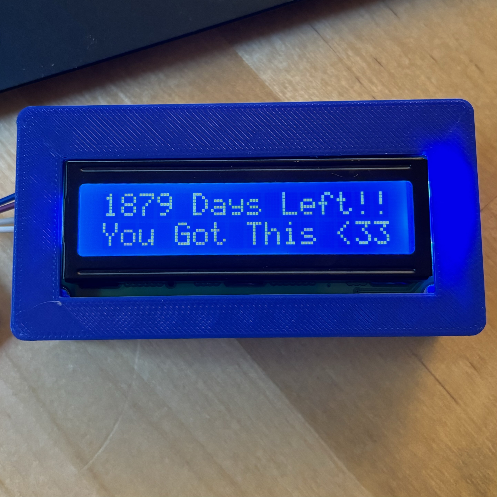

# specialdate

Gives you that little motivation you need in the morning 

## Build Requirements
+ Arduino IDE 
+ [DS3231](https://github.com/NorthernWidget/DS3231/blob/master/Documentation/Time-Set.md#void-setdowbyte-dow)
+ [LiquidCrystal_I2C](https://github.com/lucasmaziero/LiquidCrystal_I2C)

## Hardware 
- Arduino Nano 
- 16x2 LCD
- DS3231 RTC

## To Use 
- Change the CALIB* macros to your current date and flash the arduino 
- after that coment out the rtc.set* in the setup function
- flash again 
- you're good to go 
